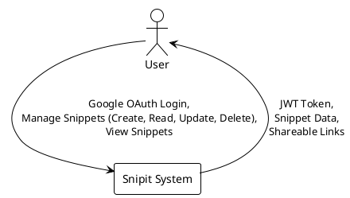
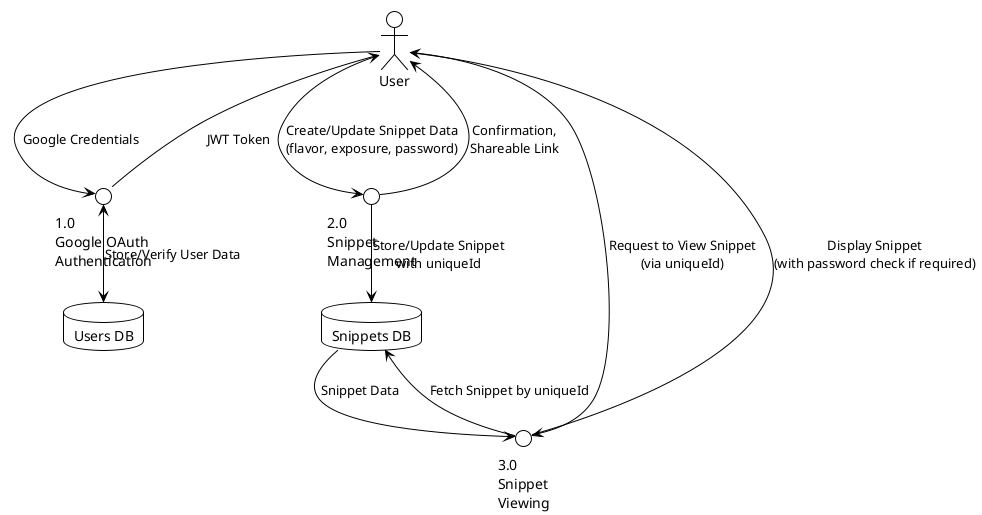
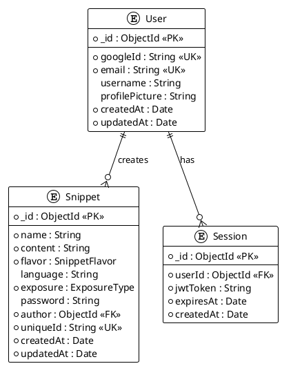
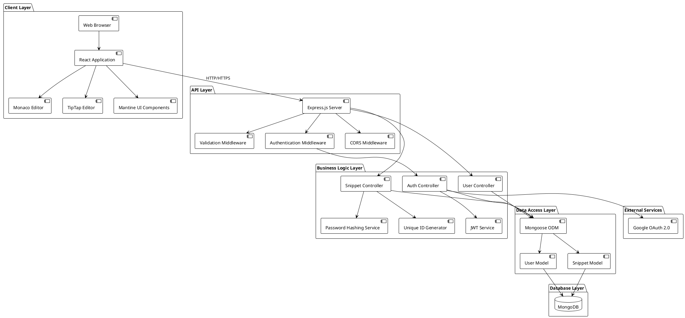
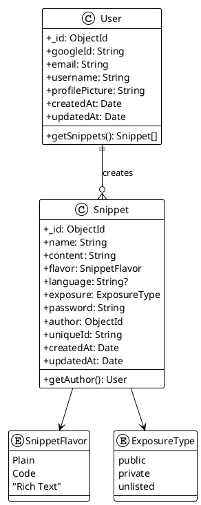

# Synopsis

## 1. Title of the Project

**Snipit: A Secure and Shareable Snippet Management System**

## 2. Introduction and Objectives

In the digital age, the ability to quickly capture, manage, and share information is paramount for productivity and collaboration. Developers, writers, students, and professionals constantly work with fragments of information—code snippets, notes, commands, links, and temporary text. Existing tools like traditional note-taking apps can be too cumbersome for managing these small, ephemeral pieces of content, while simple text editors lack features for sharing and organization. This creates a gap for a specialized tool designed for efficient snippet management.

The "Snipit" project addresses this need by providing a streamlined web application for managing and sharing text-based snippets. The primary motivation is to offer a platform that combines the simplicity of a text editor with the power of a content management system, focused exclusively on snippets. The system is designed to be fast, accessible, and secure, allowing users to save three different "flavors" of content: Plain text, Code (with syntax highlighting), and Rich Text (with formatting).

The core of the project revolves around flexible sharing and access control. Users can keep snippets private for personal use, share them publicly with a wide audience, or share them selectively using unlisted links, which can be optionally password-protected. This granular control ensures that users can confidently store both sensitive information and public-facing content within the same platform. Upon saving, each snippet is assigned a unique, short, and shareable URL, making it easy to distribute.

**Objectives:**

- **To develop a robust web application** for creating, editing, and deleting snippets of various flavors (Plain text, Code with language syntax, Rich text).
- **To implement a secure user authentication system** using Google OAuth 2.0 to manage user accounts and protect private snippets.
- **To design and implement a flexible exposure and sharing system**, including public, private, and unlisted (password-protected) options.
- **To automatically generate unique and persistent links** for each snippet using nanoid to facilitate easy sharing.
- **To provide a clean, intuitive, and responsive user interface** using modern UI components for a seamless user experience across different devices.
- **To ensure the application is performant and scalable** using a client-server architecture to handle a growing number of users and snippets.

Real-world applications for Snipit are numerous. A developer can use it to store and share reusable code fragments with their team, including specific programming language syntax highlighting. A technical support agent can use it to quickly share command-line instructions with a customer. An educator can create and share notes or formatted content with students using rich text capabilities. In essence, Snipit can serve as a centralized hub for any user who needs to manage and share small blocks of information efficiently.

## 3. Project Category

**Category:** Web Application / NoSQL Database System

**Justification:**

This project falls primarily into the **Web Application** category, as its core is a user-facing application delivered over the internet via a web browser. It involves modern front-end development using React with Vite and back-end development using Node.js with Express.js for server-side logic, RESTful API, and database interaction.

It also has a strong **NoSQL Database** component. The system's functionality relies heavily on a MongoDB database to store and manage data for users and snippets with their associated properties (like exposure, passwords, flavors, and relationships). The flexible schema nature of MongoDB is well-suited for the varying structure of different snippet types and the evolving nature of the application. The use of Mongoose ODM provides structured data modeling and validation while maintaining NoSQL flexibility.

## 4. Analysis

### Data Flow Diagrams (DFD)

Here are the Level 0 and Level 1 DFDs representing the flow of data within the Snipit system.

**Level 0 DFD (Context Diagram)**



**Level 1 DFD**



**Level 2 DFD (Detailed Process Breakdown)**

```plantuml
@startuml Level2_DFD
!theme plain
skinparam backgroundColor white
skinparam defaultFontName Arial

actor User
circle "1.1\nValidate Google\nCredentials" as ValidateAuth
circle "1.2\nGenerate JWT\nToken" as GenerateJWT
circle "1.3\nStore User\nProfile" as StoreProfile

circle "2.1\nValidate Snippet\nData" as ValidateSnippet
circle "2.2\nGenerate Unique\nID" as GenerateID
circle "2.3\nHash Password\n(if unlisted)" as HashPassword
circle "2.4\nStore Snippet" as StoreSnippet

circle "3.1\nRetrieve Snippet\nby ID" as RetrieveSnippet
circle "3.2\nCheck Access\nPermissions" as CheckAccess
circle "3.3\nVerify Password\n(if required)" as VerifyPassword
circle "3.4\nFormat Response" as FormatResponse

database "Users DB" as UsersDB
database "Snippets DB" as SnippetsDB
datastore "JWT Store" as JWTStore

User --> ValidateAuth : Google OAuth Token
ValidateAuth --> GenerateJWT : Valid Credentials
GenerateJWT --> StoreProfile : JWT Token
StoreProfile --> UsersDB : User Data
GenerateJWT --> JWTStore : Store JWT
GenerateJWT --> User : JWT Token

User --> ValidateSnippet : Snippet Data
ValidateSnippet --> GenerateID : Valid Data
GenerateID --> HashPassword : Unique ID
HashPassword --> StoreSnippet : Hashed Password (optional)
StoreSnippet --> SnippetsDB : Complete Snippet
StoreSnippet --> User : Success Response

User --> RetrieveSnippet : Snippet ID Request
RetrieveSnippet --> SnippetsDB : Query by uniqueId
SnippetsDB --> CheckAccess : Snippet Data
CheckAccess --> VerifyPassword : Access Check Result
VerifyPassword --> FormatResponse : Password Verification
FormatResponse --> User : Formatted Snippet

@enduml
```

### Entity-Relationship Diagram

The following ER diagram illustrates the relationships between entities in the Snipit system:



### System Architecture Diagram



### Class Diagram

This class diagram illustrates the main entities of the system and their relationships.



### Database Schema and Design

The database is designed using MongoDB with Mongoose ODM, featuring two primary collections: `User` and `Snippet`.

- **`User` Collection**: Stores information about users authenticated via Google OAuth.

  - `_id` (ObjectId, Primary Key): MongoDB's auto-generated unique identifier.
  - `googleId` (String, Required, Unique): Google's unique identifier for the user.
  - `email` (String, Required, Unique, Lowercase, Trimmed): User's email address from Google.
  - `username` (String, Optional): User's display name from Google profile.
  - `profilePicture` (String, Optional): URL to user's Google profile picture.
  - `createdAt` (Date, Auto-generated): Account creation timestamp.
  - `updatedAt` (Date, Auto-generated): Last update timestamp.

- **`Snippet` Collection**: Stores the snippets created by users.
  - `_id` (ObjectId, Primary Key): MongoDB's auto-generated unique identifier.
  - `name` (String, Required, Trimmed): The title/name of the snippet.
  - `content` (String, Required): The main content of the snippet.
  - `flavor` (String, Required, Enum): Type of snippet ("Plain", "Code", "Rich Text").
  - `language` (String, Conditional): Programming language for Code flavor snippets.
  - `exposure` (String, Required, Enum, Default: "public"): Visibility setting ("public", "private", "unlisted").
  - `password` (String, Optional, Hashed): Bcrypt-hashed password for unlisted snippets.
  - `author` (ObjectId, Required, Reference): Reference to the User who created the snippet.
  - `uniqueId` (String, Required, Unique): Nanoid-generated unique identifier for URL sharing.
  - `createdAt` (Date, Auto-generated): Snippet creation timestamp.
  - `updatedAt` (Date, Auto-generated): Last update timestamp.

**Relationships:**

- A **one-to-many relationship** exists between `User` and `Snippet`. One user can create many snippets, but each snippet belongs to only one user (`author` field).
- The `author` field in the `Snippet` collection is indexed for fast lookups.
- Additional indexes exist on `exposure` and `createdAt` for efficient querying of public snippets.

## 5. Project Structure

### Modules

1.  **Authentication Module (Google OAuth + JWT)**:

    - **Description**: Handles user authentication exclusively through Google OAuth 2.0. Upon successful authentication, generates JWT tokens for session management. The system stores minimal user information (Google ID, email, username, profile picture) and doesn't require traditional password-based authentication.
    - **Core Functions**: `googleOAuthCallback()`, `generateJWT()`, `verifyJWT()`, `refreshToken()`, `logout()`.

2.  **API/Backend Module (Express.js + Node.js)**:

    - **Description**: Provides RESTful API endpoints using Express.js framework. Handles all CRUD operations for snippets, implements authentication middleware, password hashing for protected snippets, and business logic for access control based on exposure types.
    - **Core Functions**:
      - Snippets: `POST /api/snippets`, `GET /api/snippets/public`, `POST /api/snippets/:id/public-view`, `GET /api/snippets/user`, `PUT /api/snippets/:id`, `DELETE /api/snippets/:id`
      - Auth: `GET /api/auth/google`, `GET /api/auth/google/callback`, `POST /api/auth/refresh`, `POST /api/auth/logout`

3.  **Database Module (MongoDB + Mongoose ODM)**:

    - **Description**: Uses MongoDB as the primary database with Mongoose ODM for data modeling, validation, and query building. Provides structured schemas while maintaining NoSQL flexibility for different snippet types.
    - **Core Functions**: `User.findOne()`, `Snippet.create()`, `Snippet.findOne()`, `Snippet.updateOne()`, `Snippet.deleteOne()`, connection management and schema validation.

4.  **Frontend/UI Module (React + Vite + Mantine)**:

    - **Description**: Modern React application built with Vite for fast development and building. Uses Mantine UI component library for consistent, accessible interface components. Includes features like Monaco Editor for code editing, TipTap for rich text editing, and Zustand for state management.
    - **Core Components**: Authentication page, Main dashboard, Snippet creation/editing forms, Public snippet viewer, Loading states, and error handling.

5.  **Validation and Security Module**:

    - **Description**: Implements comprehensive input validation, sanitization, and security measures. Handles rate limiting, CSRF protection, input sanitization for XSS prevention, and secure password hashing for unlisted snippets.
    - **Core Functions**: `validateSnippetInput()`, `sanitizeContent()`, `rateLimitMiddleware()`, `csrfProtection()`, `hashPassword()`, `validatePassword()`.

6.  **Utility and Helper Module**:
    - **Description**: Provides common utility functions used across the application. Includes unique ID generation, date formatting, content type detection, and error handling utilities.
    - **Core Functions**: `generateUniqueId()`, `formatDate()`, `detectContentType()`, `handleError()`, `validateEmail()`, `truncateText()`.

### Data Structures

**Frontend State Management (Zustand Store)**

```javascript
// User State Structure
interface UserState {
  user: {
    id: string,
    email: string,
    username: string,
    profilePicture: string,
  } | null;
  isAuthenticated: boolean;
  isLoading: boolean;
  error: string | null;
}

// Snippet State Structure
interface SnippetState {
  snippets: Snippet[];
  currentSnippet: Snippet | null;
  isLoading: boolean;
  error: string | null;
  filters: {
    flavor: "all" | "Plain" | "Code" | "Rich Text",
    exposure: "all" | "public" | "private" | "unlisted",
    sortBy: "createdAt" | "updatedAt" | "name",
    sortOrder: "asc" | "desc",
  };
}

// UI State Structure
interface UIState {
  theme: "light" | "dark";
  sidebarOpen: boolean;
  activeModal: string | null;
  notifications: Notification[];
}
```

**Backend Data Transfer Objects (DTOs)**

```javascript
// Create Snippet Request DTO
interface CreateSnippetDTO {
  name: string; // Required, 1-100 characters
  content: string; // Required, max 50KB
  flavor: "Plain" | "Code" | "Rich Text";
  language?: string; // Required if flavor is 'Code'
  exposure: "public" | "private" | "unlisted";
  password?: string; // Optional, for unlisted snippets
}

// Update Snippet Request DTO
interface UpdateSnippetDTO {
  name?: string;
  content?: string;
  flavor?: "Plain" | "Code" | "Rich Text";
  language?: string;
  exposure?: "public" | "private" | "unlisted";
  password?: string;
}

// Snippet Response DTO
interface SnippetResponseDTO {
  id: string;
  name: string;
  content: string;
  flavor: string;
  language?: string;
  exposure: string;
  author: {
    id: string,
    username: string,
    profilePicture?: string,
  };
  uniqueId: string;
  createdAt: string;
  updatedAt: string;
  isAuthor: boolean;
}
```

**Database Index Strategies**

```javascript
// User Collection Indexes
db.users.createIndex({ googleId: 1 }, { unique: true });
db.users.createIndex({ email: 1 }, { unique: true });
db.users.createIndex({ createdAt: -1 });

// Snippet Collection Indexes
db.snippets.createIndex({ uniqueId: 1 }, { unique: true });
db.snippets.createIndex({ author: 1, createdAt: -1 });
db.snippets.createIndex({ exposure: 1, createdAt: -1 });
db.snippets.createIndex({ flavor: 1 });
db.snippets.createIndex({ name: "text", content: "text" }); // Text search
```

**API Response Structures**

```javascript
// Success Response Structure
interface APISuccessResponse<T> {
  success: true;
  data: T;
  message?: string;
  pagination?: {
    page: number,
    limit: number,
    total: number,
    totalPages: number,
  };
}

// Error Response Structure
interface APIErrorResponse {
  success: false;
  error: {
    code: string,
    message: string,
    details?: any,
  };
  timestamp: string;
}

// Authentication Response
interface AuthResponse {
  user: {
    id: string,
    email: string,
    username: string,
    profilePicture?: string,
  };
  token: string;
  refreshToken: string;
  expiresIn: number;
}
```

### Pseudocode for Core Functions

**Create Snippet Logic (`/api/snippets` - POST)**

```
FUNCTION handleCreateSnippet(request):
  // Verify JWT token
  token = extractJWTFromHeaders(request)
  user = verifyJWT(token)
  IF user is NULL:
    RETURN 401 Unauthorized

  data = parse_json_body(request)
  // Validation: check required fields
  IF data.name OR data.content OR data.flavor is missing:
    RETURN 400 Bad Request

  // Generate unique ID using nanoid
  uniqueId = nanoid(10)

  snippetData = {
    name: data.name,
    content: data.content,
    flavor: data.flavor,
    exposure: data.exposure || "public",
    author: user._id,
    uniqueId: uniqueId
  }

  // Add language for Code flavor
  IF data.flavor == "Code" AND data.language:
    snippetData.language = data.language

  // Hash password for unlisted snippets
  IF data.exposure == "unlisted" AND data.password:
    snippetData.password = bcrypt.hash(data.password, 10)

  newSnippet = Snippet.create(snippetData)
  RETURN 201 Created, { snippet: newSnippet }
```

**View Snippet Logic (`/snippets/:id/public-view` - POST)**

```
FUNCTION handleViewSnippet(uniqueId, request):
  snippet = Snippet.findOne({ uniqueId: uniqueId }).populate("author")
  IF snippet is NULL:
    RETURN 404 Not Found

  // Check access permissions
  isAuthor = (user AND user._id == snippet.author._id)

  IF snippet.exposure == "private" AND NOT isAuthor:
    RETURN 403 Forbidden

  IF snippet.exposure == "unlisted" AND snippet.password AND NOT isAuthor:
    userPassword = request.body.password
    IF NOT userPassword:
      RETURN 200 { requiresPassword: true }

    IF NOT bcrypt.compare(userPassword, snippet.password):
      RETURN 401 Unauthorized

  RETURN 200 { snippet: snippet, isAuthor: isAuthor }
```

**Authentication Logic (`/api/auth/google/callback` - GET)**

```
FUNCTION handleGoogleCallback(request):
  authCode = request.query.code
  IF authCode is NULL:
    RETURN 400 Bad Request

  // Exchange code for Google user info
  googleUserInfo = exchangeCodeForUserInfo(authCode)
  IF googleUserInfo is NULL:
    RETURN 401 Unauthorized

  // Check if user exists
  existingUser = User.findOne({ googleId: googleUserInfo.id })

  IF existingUser is NULL:
    // Create new user
    newUser = User.create({
      googleId: googleUserInfo.id,
      email: googleUserInfo.email,
      username: googleUserInfo.name,
      profilePicture: googleUserInfo.picture
    })
    user = newUser
  ELSE:
    // Update existing user info
    existingUser.username = googleUserInfo.name
    existingUser.profilePicture = googleUserInfo.picture
    existingUser.save()
    user = existingUser

  // Generate JWT tokens
  accessToken = generateJWT(user._id, "15m")
  refreshToken = generateJWT(user._id, "7d")

  // Store refresh token
  storeRefreshToken(user._id, refreshToken)

  RETURN 200 { user: user, accessToken: accessToken, refreshToken: refreshToken }
```

**Update Snippet Logic (`/api/snippets/:id` - PUT)**

```
FUNCTION handleUpdateSnippet(snippetId, request):
  // Verify JWT token
  token = extractJWTFromHeaders(request)
  user = verifyJWT(token)
  IF user is NULL:
    RETURN 401 Unauthorized

  // Find snippet
  snippet = Snippet.findOne({ _id: snippetId })
  IF snippet is NULL:
    RETURN 404 Not Found

  // Check ownership
  IF snippet.author != user._id:
    RETURN 403 Forbidden

  data = parse_json_body(request)

  // Validate and update fields
  IF data.name:
    snippet.name = data.name
  IF data.content:
    snippet.content = data.content
  IF data.flavor:
    snippet.flavor = data.flavor
    IF data.flavor == "Code" AND data.language:
      snippet.language = data.language
    ELSE IF data.flavor != "Code":
      snippet.language = NULL

  IF data.exposure:
    snippet.exposure = data.exposure
    IF data.exposure == "unlisted" AND data.password:
      snippet.password = bcrypt.hash(data.password, 10)
    ELSE IF data.exposure != "unlisted":
      snippet.password = NULL

  snippet.updatedAt = new Date()
  updatedSnippet = snippet.save()

  RETURN 200 { snippet: updatedSnippet }
```

### Process Logic for Each Module

**1. Authentication Module Process Flow**

1. **Google OAuth Initiation**: User clicks "Sign in with Google" → Redirect to Google OAuth consent screen
2. **Callback Handling**: Google redirects back with authorization code → Exchange code for user profile
3. **User Management**: Check if user exists in database → Create new user or update existing user profile
4. **Token Generation**: Generate JWT access token (15min) and refresh token (7 days)
5. **Session Management**: Store refresh token securely → Return tokens to client
6. **Token Refresh**: When access token expires → Use refresh token to generate new access token
7. **Logout**: Invalidate refresh token → Clear client-side tokens

**2. Snippet Management Module Process Flow**

1. **Create Snippet**: Validate input → Generate unique ID → Hash password (if unlisted) → Store in database
2. **Read Snippets**: Check user authentication → Apply filters → Paginate results → Return snippets
3. **Update Snippet**: Verify ownership → Validate changes → Update database → Return updated snippet
4. **Delete Snippet**: Verify ownership → Remove from database → Return confirmation
5. **Public View**: Check snippet existence → Verify access permissions → Handle password protection → Return snippet

**3. Frontend Module Process Flow**

1. **Application Initialization**: Load user session → Initialize state management → Setup routing
2. **Authentication Flow**: Handle OAuth redirect → Store tokens → Update user state
3. **Snippet Creation**: Validate form input → Send API request → Update local state → Show confirmation
4. **Snippet Editing**: Load snippet data → Enable editing mode → Save changes → Sync with server
5. **Public Viewing**: Parse URL parameters → Fetch snippet → Handle password prompt → Display content

### Testing Strategies

**Unit Testing Framework and Approach**

- **Backend Testing (Jest + Supertest)**:

  - **Controller Tests**: Mock database operations and test API endpoints with various input scenarios
  - **Service Tests**: Test business logic functions in isolation with mocked dependencies
  - **Utility Tests**: Test helper functions like password hashing, JWT generation, and unique ID creation
  - **Middleware Tests**: Test authentication, validation, and error handling middleware
  - **Model Tests**: Test Mongoose schema validation and custom methods

- **Frontend Testing (Vitest + React Testing Library)**:
  - **Component Tests**: Test React components with different props and state scenarios
  - **Hook Tests**: Test custom React hooks with various input conditions
  - **Store Tests**: Test Zustand state management with different actions and state changes
  - **Integration Tests**: Test component interactions and form submissions
  - **Accessibility Tests**: Ensure components meet WCAG guidelines using jest-axe

**Integration Testing Strategy**

- **API Integration Tests**: Test complete request-response cycles with real database connections
- **Authentication Flow Tests**: Test OAuth flow with mocked Google services
- **Database Integration Tests**: Test CRUD operations with test database instances
- **End-to-End User Flows**: Test critical user journeys from login to snippet creation and sharing

**Testing Environment Setup**

```javascript
// Test Database Configuration
const testConfig = {
  mongodb: {
    uri: "mongodb://localhost:27017/snipit_test",
    options: { useNewUrlParser: true, useUnifiedTopology: true },
  },
  jwt: {
    secret: "test_jwt_secret",
    expiresIn: "15m",
  },
  google: {
    clientId: "mock_google_client_id",
    clientSecret: "mock_google_client_secret",
  },
};

// Test Data Factories
const createTestUser = () => ({
  googleId: "test_google_id",
  email: "test@example.com",
  username: "Test User",
  profilePicture: "https://example.com/avatar.jpg",
});

const createTestSnippet = (userId) => ({
  name: "Test Snippet",
  content: 'console.log("Hello, World!");',
  flavor: "Code",
  language: "javascript",
  exposure: "public",
  author: userId,
  uniqueId: "test123456",
});
```

**Performance Testing**

- **Load Testing**: Use Artillery or k6 to test API endpoints under various load conditions
- **Database Performance**: Test query performance with large datasets and optimize indexes
- **Frontend Performance**: Use Lighthouse and Web Vitals to measure and optimize loading times
- **Memory Usage**: Monitor memory consumption during extended usage sessions

**Security Testing**

- **Authentication Security**: Test JWT token validation, expiration, and refresh mechanisms
- **Authorization Testing**: Verify access controls for private and unlisted snippets
- **Input Validation**: Test XSS prevention, SQL injection resistance, and input sanitization
- **Rate Limiting**: Test API rate limiting and abuse prevention mechanisms

### Reports Generation

The Snipit system will generate comprehensive reports for monitoring, analytics, and administrative purposes. These reports will be essential for understanding system usage, performance metrics, and user behavior patterns.

**1. System Performance Reports**

- **Database Performance Metrics**:

  - Query execution times and optimization recommendations
  - Index usage statistics and suggestions for new indexes
  - Collection size growth trends and storage utilization
  - Connection pool usage and database load patterns

- **API Performance Analytics**:

  - Response time distribution across different endpoints
  - Request volume patterns and peak usage periods
  - Error rate analysis with categorization by error types
  - Rate limiting effectiveness and abuse detection metrics

- **Frontend Performance Metrics**:
  - Page load times and Core Web Vitals measurements
  - Bundle size analysis and optimization opportunities
  - User interaction response times and UI performance
  - Browser compatibility and device usage statistics

**2. User Analytics and Behavior Reports**

- **User Engagement Metrics**:

  - Daily, weekly, and monthly active user counts
  - User retention rates and churn analysis
  - Session duration and frequency patterns
  - Feature adoption rates across different user segments

- **Snippet Usage Analytics**:

  - Total snippets created, updated, and deleted over time
  - Distribution of snippet flavors (Plain, Code, Rich Text)
  - Most popular programming languages for code snippets
  - Exposure type preferences (public, private, unlisted)

- **Sharing and Collaboration Metrics**:
  - Public snippet view counts and engagement rates
  - Password-protected snippet access patterns
  - Geographic distribution of snippet viewers
  - Referral sources for public snippet traffic

**3. Security and Compliance Reports**

- **Authentication and Access Reports**:

  - Login success and failure rates
  - JWT token usage and refresh patterns
  - Suspicious login attempt detection and blocking
  - OAuth integration health and error tracking

- **Data Protection and Privacy Metrics**:
  - Password-protected snippet creation trends
  - Private snippet access control effectiveness
  - Data retention compliance and cleanup activities
  - User data export and deletion request processing

**4. Administrative and Operational Reports**

- **System Health Monitoring**:

  - Server uptime and availability metrics
  - Resource utilization (CPU, memory, disk, network)
  - Error logs analysis and categorization
  - Backup and recovery operation status

- **Content Moderation Reports**:
  - Automated content scanning results
  - Reported content review and action taken
  - Spam detection and prevention effectiveness
  - Terms of service violation tracking

**Report Generation Implementation Plan**

```javascript
// Report Service Architecture
class ReportService {
  // Generate daily system metrics
  async generateDailyMetrics() {
    return {
      userMetrics: await this.getUserMetrics(),
      snippetMetrics: await this.getSnippetMetrics(),
      performanceMetrics: await this.getPerformanceMetrics(),
      securityMetrics: await this.getSecurityMetrics(),
    };
  }

  // Generate weekly trend analysis
  async generateWeeklyTrends() {
    return {
      userGrowth: await this.calculateUserGrowth(),
      contentTrends: await this.analyzeContentTrends(),
      performanceTrends: await this.trackPerformanceTrends(),
      engagementTrends: await this.measureEngagementTrends(),
    };
  }

  // Generate monthly comprehensive report
  async generateMonthlyReport() {
    return {
      executiveSummary: await this.createExecutiveSummary(),
      detailedAnalytics: await this.compileDetailedAnalytics(),
      recommendations: await this.generateRecommendations(),
      forecastProjections: await this.createForecastProjections(),
    };
  }
}
```

**Report Delivery and Visualization**

- **Automated Report Generation**: Scheduled daily, weekly, and monthly report generation
- **Dashboard Integration**: Real-time metrics displayed in administrative dashboard
- **Email Notifications**: Critical alerts and summary reports sent to administrators
- **Export Capabilities**: Reports available in PDF, CSV, and JSON formats
- **Historical Data Analysis**: Trend analysis with configurable time ranges
- **Custom Report Builder**: Flexible reporting tool for ad-hoc analysis needs

**Sample Report Contents**

_Daily System Health Report_:

- System uptime: 99.98%
- Total API requests: 15,847
- Average response time: 245ms
- New user registrations: 23
- Snippets created: 156
- Error rate: 0.02%

_Weekly User Engagement Report_:

- Weekly active users: 1,247 (+8.3% from previous week)
- Average session duration: 12.5 minutes
- Most popular snippet flavor: Code (62%)
- Top programming languages: JavaScript (34%), Python (28%), HTML (18%)
- Public snippet views: 8,934

_Monthly Performance Analysis_:

- Database query optimization improved response times by 15%
- Frontend bundle size reduced by 12% through code splitting
- User retention rate: 78% (30-day retention)
- System scalability recommendations for projected growth

## 6. Tools, Platform, Hardware/Software Requirements

- **Languages**: JavaScript, HTML, CSS
- **Frontend Framework/Libraries**:
  - **Core**: React 19.1.0 with Vite 6.3.5 for build tooling
  - **UI Components**: Mantine 7.17.8 (comprehensive React components library)
  - **Code Editor**: Monaco Editor (VS Code's editor)
  - **Rich Text Editor**: TipTap with extensions for rich text formatting
  - **State Management**: Zustand 5.0.5 for client-side state
  - **HTTP Client**: Axios for API communication
  - **Routing**: React Router DOM 7.6.1
- **Backend Framework/Libraries**:
  - **Server**: Node.js with Express.js 5.1.0
  - **Authentication**: Passport.js with Google OAuth 2.0 strategy
  - **JWT**: jsonwebtoken for session management
  - **Password Hashing**: bcryptjs for unlisted snippet passwords
  - **Unique ID Generation**: nanoid for snippet unique identifiers
  - **CORS**: cors middleware for cross-origin requests
- **Database**: MongoDB with Mongoose 8.15.0 ODM
- **Platform/OS**:
  - **Development**: Any modern OS (Windows, macsOS, Linux)
  - **Deployment**: Cloud platforms supporting Node.js (e.g., Railway, Render, AWS, DigitalOcean)
- **Software Requirements**:
  - Node.js (v18 or later)
  - npm/yarn/pnpm package manager
  - MongoDB database (local or cloud like MongoDB Atlas)
  - Google Cloud Console project for OAuth credentials
  - Modern web browser (Chrome, Firefox, Safari, Edge)
- **Hardware Requirements**:
  - **Development**: Standard developer machine (8GB RAM, 2-core CPU, 256GB SSD)
  - **Server (Deployment)**: Scalable cloud instance (starts with 1 vCPU, 1GB RAM, can scale based on usage)

### Development Environment Setup

**Local Development Stack**:

- **Code Editor**: Visual Studio Code with extensions (ES7+ React/Redux/React-Native snippets, Prettier, ESLint, MongoDB for VS Code)
- **Version Control**: Git with GitHub for repository hosting and collaboration
- **Package Management**: npm or yarn for dependency management
- **Development Server**: Vite dev server for frontend, nodemon for backend hot reloading
- **Database**: MongoDB Community Edition or MongoDB Atlas for cloud database
- **API Testing**: Postman or Insomnia for API endpoint testing and documentation

**Production Deployment Architecture**:

- **Frontend Hosting**: Vercel, Netlify, or AWS S3 + CloudFront for static site hosting
- **Backend Hosting**: Railway, Render, Heroku, or AWS EC2 for Node.js application hosting
- **Database**: MongoDB Atlas for managed database service with automated backups
- **CDN**: CloudFlare or AWS CloudFront for global content delivery
- **Monitoring**: New Relic, DataDog, or AWS CloudWatch for application monitoring
- **Error Tracking**: Sentry for real-time error tracking and performance monitoring

**Security and Compliance Tools**:

- **SSL/TLS**: Let's Encrypt or AWS Certificate Manager for HTTPS encryption
- **Environment Variables**: dotenv for local development, platform-specific secret management for production
- **Rate Limiting**: express-rate-limit middleware for API protection
- **Input Validation**: Joi or Yup for comprehensive input validation and sanitization
- **Security Headers**: Helmet.js for setting security-related HTTP headers

### Project Development Timeline

**Phase 1: Project Setup and Foundation (Weeks 1-2)**

- Set up development environment and project structure
- Initialize Git repository and establish branching strategy
- Configure MongoDB database and create initial schemas
- Set up Google OAuth 2.0 credentials and authentication flow
- Create basic Express.js server with essential middleware
- Implement JWT token generation and validation system
- Set up React application with Vite and basic routing

**Phase 2: Core Backend Development (Weeks 3-5)**

- Implement User model and authentication endpoints
- Develop Snippet model with all required fields and validations
- Create CRUD API endpoints for snippet management
- Implement password hashing for unlisted snippets
- Add unique ID generation using nanoid
- Develop middleware for authentication and authorization
- Implement input validation and sanitization
- Add comprehensive error handling and logging

**Phase 3: Frontend User Interface Development (Weeks 6-8)**

- Design and implement authentication pages with Google OAuth
- Create main dashboard with snippet listing and filtering
- Develop snippet creation form with flavor selection
- Implement Monaco Editor for code snippets with syntax highlighting
- Integrate TipTap editor for rich text snippets
- Build snippet viewing and editing interfaces
- Add responsive design for mobile and tablet devices
- Implement state management with Zustand

**Phase 4: Advanced Features and Integration (Weeks 9-10)**

- Implement public snippet sharing functionality
- Add password protection for unlisted snippets
- Develop snippet search and filtering capabilities
- Create user profile management features
- Add snippet export and import functionality
- Implement real-time preview for all snippet flavors
- Add keyboard shortcuts and accessibility features

**Phase 5: Testing and Quality Assurance (Weeks 11-12)**

- Write comprehensive unit tests for backend API
- Develop frontend component and integration tests
- Perform security testing and vulnerability assessment
- Conduct performance testing and optimization
- Test cross-browser compatibility and responsive design
- Implement automated testing pipeline with CI/CD
- Perform user acceptance testing with beta users

**Phase 6: Deployment and Documentation (Weeks 13-14)**

- Set up production environment and deployment pipeline
- Configure monitoring and error tracking systems
- Create comprehensive API documentation
- Write user guides and help documentation
- Implement analytics and reporting systems
- Perform final security audit and penetration testing
- Launch application and monitor initial user feedback

**Phase 7: Post-Launch Support and Iteration (Weeks 15-16)**

- Monitor system performance and user behavior
- Address any critical bugs or security issues
- Gather user feedback and prioritize feature requests
- Implement minor enhancements and optimizations
- Plan future development phases and feature roadmap
- Document lessons learned and best practices

## 7. Industry/Client Association

This is an **academic project**. It is conceived and developed as a part of academic coursework and to build a portfolio. It is not associated with any external client or commercial organization. The primary goal is educational and to demonstrate proficiency in full-stack web development using modern technologies and industry-standard practices.

## 8. Future Scope and Enhancements

The Snipit platform has significant potential for expansion and enhancement. The following roadmap outlines planned features and improvements that will be considered for future development phases:

### Phase 1 Enhancements (Short-term: 3-6 months)

**Advanced Snippet Management**:

- **Snippet Organization**: Implement hierarchical folder structure with drag-and-drop organization, tagging system with auto-suggestions, and advanced filtering options (by date, size, language, etc.)
- **Bulk Operations**: Enable users to select multiple snippets for batch operations like delete, move, change exposure, or export
- **Snippet Templates**: Provide pre-built templates for common use cases (API responses, configuration files, documentation snippets)
- **Duplicate Detection**: Automatically detect and suggest merging of similar or duplicate snippets

**Enhanced User Experience**:

- **Dark/Light Theme Toggle**: Implement comprehensive theming system with user preference persistence
- **Keyboard Shortcuts**: Add comprehensive keyboard navigation and shortcuts for power users
- **Snippet Bookmarking**: Allow users to bookmark and organize favorite public snippets from other users
- **Recent Activity Dashboard**: Show recently viewed, edited, and created snippets with quick access

### Phase 2 Enhancements (Medium-term: 6-12 months)

**Collaboration and Sharing Features**:

- **Real-time Collaborative Editing**: Implement WebSocket-based real-time editing using libraries like Yjs or ShareJS for simultaneous multi-user editing
- **Comment System**: Add commenting functionality on public snippets with threaded discussions and notifications
- **Snippet Forking**: Allow users to create copies of public snippets with attribution to original authors
- **Team Workspaces**: Create shared workspaces for organizations with role-based access control (admin, editor, viewer)

**Advanced Code Features**:

- **Syntax Validation**: Integrate Language Server Protocol (LSP) for real-time syntax checking, error highlighting, and auto-completion
- **Code Execution Environment**: Implement sandboxed code execution using Docker containers or WebAssembly for safe code testing
- **Multi-file Snippet Support**: Enable snippets to contain multiple related files with file tree navigation and cross-file references
- **Code Formatting**: Integrate Prettier and language-specific formatters for automatic code beautification

**Search and Discovery**:

- **Full-text Search**: Implement Elasticsearch or MongoDB Atlas Search for advanced content searching with fuzzy matching and relevance scoring
- **Snippet Recommendations**: Use machine learning algorithms to suggest relevant snippets based on user behavior and content similarity
- **Public Snippet Gallery**: Create a curated gallery of high-quality public snippets with categories and featured content
- **Advanced Filtering**: Add filters for programming language, snippet size, creation date, popularity, and user ratings

### Phase 3 Enhancements (Long-term: 12+ months)

**AI and Machine Learning Integration**:

- **AI-Powered Code Analysis**: Integrate with large language models (GPT-4, Claude, or Codex) to provide:
  - Code explanation and documentation generation
  - Bug detection and security vulnerability scanning
  - Code refactoring suggestions and optimization recommendations
  - Automatic test case generation for code snippets
- **Smart Categorization**: Use natural language processing to automatically categorize and tag snippets based on content analysis
- **AI-Generated Snippets**: Allow users to generate code or text from natural language prompts with customizable parameters
- **Intelligent Code Completion**: Provide context-aware code suggestions based on existing snippet patterns

**Platform Extensions**:

- **Desktop Application**: Develop cross-platform desktop app using Electron or Tauri with:
  - System tray integration for quick snippet access
  - Global hotkeys for instant snippet creation
  - Offline synchronization capabilities
  - Native OS integration (clipboard monitoring, file drag-and-drop)
- **Mobile Applications**: Create native iOS and Android apps with:
  - Touch-optimized editing interfaces
  - Camera-based code capture and OCR
  - Voice-to-text snippet creation
  - Offline access to frequently used snippets

**API and Integration Ecosystem**:

- **Public API**: Develop comprehensive RESTful API with:
  - Rate limiting and authentication for third-party developers
  - Webhook support for real-time integrations
  - GraphQL endpoint for flexible data querying
  - SDK libraries for popular programming languages
- **IDE Extensions**: Create plugins for popular IDEs:
  - Visual Studio Code extension for snippet management
  - JetBrains IDE plugins (IntelliJ, PyCharm, WebStorm)
  - Vim/Neovim plugin for terminal-based workflows
  - Sublime Text and Atom editor integrations

**Advanced Analytics and Insights**:

- **User Analytics Dashboard**: Provide detailed insights including:
  - Snippet creation and usage patterns
  - Popular programming languages and frameworks
  - Collaboration metrics and team productivity
  - Personal coding statistics and trends
- **Public Snippet Analytics**: For public snippets, show:
  - View counts and geographic distribution
  - Referral sources and social media shares
  - Fork and bookmark statistics
  - User engagement metrics and feedback

**Enterprise and Scalability Features**:

- **Enterprise SSO Integration**: Support for SAML, LDAP, and Active Directory authentication
- **Advanced Security Features**:
  - Two-factor authentication (2FA) support
  - IP whitelisting and access restrictions
  - Audit logging and compliance reporting
  - Data encryption at rest and in transit
- **High Availability Architecture**:
  - Multi-region deployment capabilities
  - Database clustering and replication
  - CDN integration for global performance
  - Automated backup and disaster recovery

**Emerging Technology Integration**:

- **Blockchain Integration**: Explore decentralized storage options and snippet ownership verification
- **WebAssembly Support**: Enable running compiled languages directly in the browser
- **Progressive Web App (PWA)**: Enhance web app with offline capabilities and native app-like experience
- **Voice Interface**: Integrate voice commands for hands-free snippet creation and navigation

### Technical Debt and Performance Improvements

**Continuous Optimization**:

- **Database Optimization**: Regular query performance analysis and index optimization
- **Frontend Performance**: Bundle size optimization, lazy loading, and code splitting improvements
- **Security Audits**: Regular penetration testing and vulnerability assessments
- **Accessibility Improvements**: Enhanced WCAG compliance and screen reader support
- **Internationalization**: Multi-language support for global user base

This comprehensive roadmap ensures that Snipit will continue to evolve as a cutting-edge snippet management platform, incorporating the latest technologies and user feedback to provide an exceptional experience for developers and content creators worldwide.
