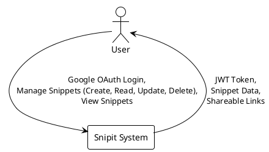
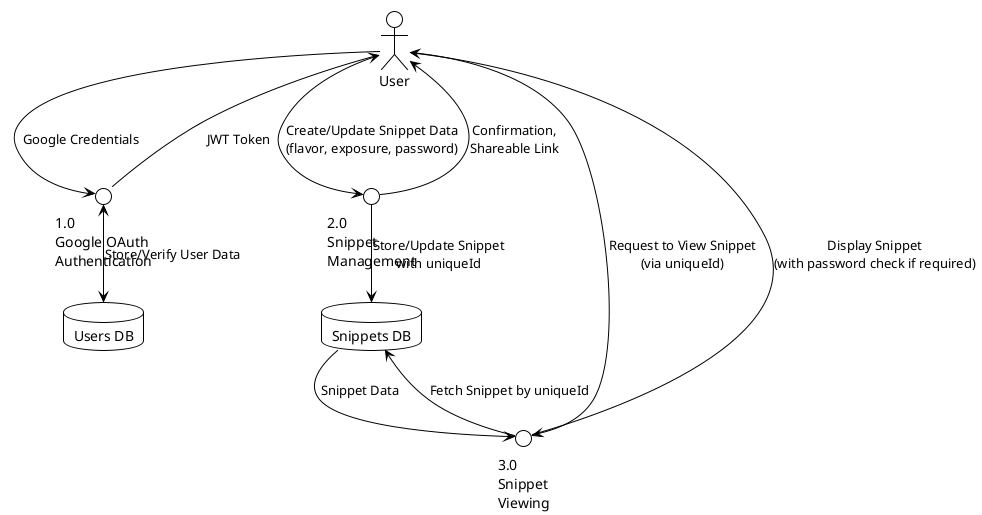
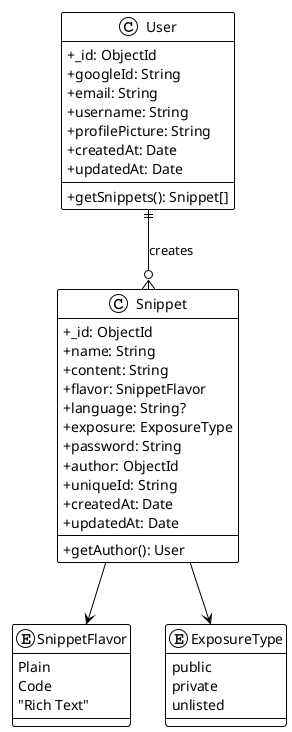

### 1. Title of the Project

**Snipit: A Secure and Shareable Snippet Management System**

### 2. Introduction and Objectives

In the digital age, the ability to quickly capture, manage, and share information is paramount for productivity and collaboration. Developers, writers, students, and professionals constantly work with fragments of information—code snippets, notes, commands, links, and temporary text. Existing tools like traditional note-taking apps can be too cumbersome for managing these small, ephemeral pieces of content, while simple text editors lack features for sharing and organization. This creates a gap for a specialized tool designed for efficient snippet management.

The "Snipit" project addresses this need by providing a streamlined web application for managing and sharing text-based snippets. The primary motivation is to offer a platform that combines the simplicity of a text editor with the power of a content management system, focused exclusively on snippets. The system is designed to be fast, accessible, and secure, allowing users to save three different "flavors" of content: Plain text, Code (with syntax highlighting), and Rich Text (with formatting).

The core of the project revolves around flexible sharing and access control. Users can keep snippets private for personal use, share them publicly with a wide audience, or share them selectively using unlisted links, which can be optionally password-protected. This granular control ensures that users can confidently store both sensitive information and public-facing content within the same platform. Upon saving, each snippet is assigned a unique, short, and shareable URL, making it easy to distribute.

**Objectives:**

- **To develop a robust web application** for creating, editing, and deleting snippets of various flavors (Plain text, Code with language syntax, Rich text).
- **To implement a secure user authentication system** using Google OAuth 2.0 to manage user accounts and protect private snippets.
- **To design and implement a flexible exposure and sharing system**, including public, private, and unlisted (password-protected) options.
- **To automatically generate unique and persistent links** for each snippet using nanoid to facilitate easy sharing.
- **To provide a clean, intuitive, and responsive user interface** using modern UI components for a seamless user experience across different devices.
- **To ensure the application is performant and scalable** using a client-server architecture to handle a growing number of users and snippets.

Real-world applications for Snipit are numerous. A developer can use it to store and share reusable code fragments with their team, including specific programming language syntax highlighting. A technical support agent can use it to quickly share command-line instructions with a customer. An educator can create and share notes or formatted content with students using rich text capabilities. In essence, Snipit can serve as a centralized hub for any user who needs to manage and share small blocks of information efficiently.

### 3. Project Category

**Category:** Web Application / NoSQL Database System

**Justification:**

This project falls primarily into the **Web Application** category, as its core is a user-facing application delivered over the internet via a web browser. It involves modern front-end development using React with Vite and back-end development using Node.js with Express.js for server-side logic, RESTful API, and database interaction.

It also has a strong **NoSQL Database** component. The system's functionality relies heavily on a MongoDB database to store and manage data for users and snippets with their associated properties (like exposure, passwords, flavors, and relationships). The flexible schema nature of MongoDB is well-suited for the varying structure of different snippet types and the evolving nature of the application. The use of Mongoose ODM provides structured data modeling and validation while maintaining NoSQL flexibility.

### 4. Analysis

#### Data Flow Diagrams (DFD)

Here are the Level 0 and Level 1 DFDs representing the flow of data within the Snipit system.

**Level 0 DFD (Context Diagram)**



**Level 1 DFD**



#### Class Diagram

This class diagram illustrates the main entities of the system and their relationships.



#### Database Schema and Design

The database is designed using MongoDB with Mongoose ODM, featuring two primary collections: `User` and `Snippet`.

- **`User` Collection**: Stores information about users authenticated via Google OAuth.

  - `_id` (ObjectId, Primary Key): MongoDB's auto-generated unique identifier.
  - `googleId` (String, Required, Unique): Google's unique identifier for the user.
  - `email` (String, Required, Unique, Lowercase, Trimmed): User's email address from Google.
  - `username` (String, Optional): User's display name from Google profile.
  - `profilePicture` (String, Optional): URL to user's Google profile picture.
  - `createdAt` (Date, Auto-generated): Account creation timestamp.
  - `updatedAt` (Date, Auto-generated): Last update timestamp.

- **`Snippet` Collection**: Stores the snippets created by users.
  - `_id` (ObjectId, Primary Key): MongoDB's auto-generated unique identifier.
  - `name` (String, Required, Trimmed): The title/name of the snippet.
  - `content` (String, Required): The main content of the snippet.
  - `flavor` (String, Required, Enum): Type of snippet ("Plain", "Code", "Rich Text").
  - `language` (String, Conditional): Programming language for Code flavor snippets.
  - `exposure` (String, Required, Enum, Default: "public"): Visibility setting ("public", "private", "unlisted").
  - `password` (String, Optional, Hashed): Bcrypt-hashed password for unlisted snippets.
  - `author` (ObjectId, Required, Reference): Reference to the User who created the snippet.
  - `uniqueId` (String, Required, Unique): Nanoid-generated unique identifier for URL sharing.
  - `createdAt` (Date, Auto-generated): Snippet creation timestamp.
  - `updatedAt` (Date, Auto-generated): Last update timestamp.

**Relationships:**

- A **one-to-many relationship** exists between `User` and `Snippet`. One user can create many snippets, but each snippet belongs to only one user (`author` field).
- The `author` field in the `Snippet` collection is indexed for fast lookups.
- Additional indexes exist on `exposure` and `createdAt` for efficient querying of public snippets.

### 5. Project Structure

#### Modules

1.  **Authentication Module (Google OAuth + JWT)**:

    - **Description**: Handles user authentication exclusively through Google OAuth 2.0. Upon successful authentication, generates JWT tokens for session management. The system stores minimal user information (Google ID, email, username, profile picture) and doesn't require traditional password-based authentication.
    - **Core Functions**: `googleOAuthCallback()`, `generateJWT()`, `verifyJWT()`, `refreshToken()`, `logout()`.

2.  **API/Backend Module (Express.js + Node.js)**:

    - **Description**: Provides RESTful API endpoints using Express.js framework. Handles all CRUD operations for snippets, implements authentication middleware, password hashing for protected snippets, and business logic for access control based on exposure types.
    - **Core Functions**:
      - Snippets: `POST /api/snippets`, `GET /api/snippets/public`, `POST /api/snippets/:id/public-view`, `GET /api/snippets/user`, `PUT /api/snippets/:id`, `DELETE /api/snippets/:id`
      - Auth: `GET /api/auth/google`, `GET /api/auth/google/callback`, `POST /api/auth/refresh`, `POST /api/auth/logout`

3.  **Database Module (MongoDB + Mongoose ODM)**:

    - **Description**: Uses MongoDB as the primary database with Mongoose ODM for data modeling, validation, and query building. Provides structured schemas while maintaining NoSQL flexibility for different snippet types.
    - **Core Functions**: `User.findOne()`, `Snippet.create()`, `Snippet.findOne()`, `Snippet.updateOne()`, `Snippet.deleteOne()`, connection management and schema validation.

4.  **Frontend/UI Module (React + Vite + Mantine)**:
    - **Description**: Modern React application built with Vite for fast development and building. Uses Mantine UI component library for consistent, accessible interface components. Includes features like Monaco Editor for code editing, TipTap for rich text editing, and Zustand for state management.
    - **Core Components**: Authentication page, Main dashboard, Snippet creation/editing forms, Public snippet viewer, Loading states, and error handling.

#### Pseudocode for Core Functions

**Create Snippet Logic (`/api/snippets` - POST)**

```
FUNCTION handleCreateSnippet(request):
  // Verify JWT token
  token = extractJWTFromHeaders(request)
  user = verifyJWT(token)
  IF user is NULL:
    RETURN 401 Unauthorized

  data = parse_json_body(request)
  // Validation: check required fields
  IF data.name OR data.content OR data.flavor is missing:
    RETURN 400 Bad Request

  // Generate unique ID using nanoid
  uniqueId = nanoid(10)

  snippetData = {
    name: data.name,
    content: data.content,
    flavor: data.flavor,
    exposure: data.exposure || "public",
    author: user._id,
    uniqueId: uniqueId
  }

  // Add language for Code flavor
  IF data.flavor == "Code" AND data.language:
    snippetData.language = data.language

  // Hash password for unlisted snippets
  IF data.exposure == "unlisted" AND data.password:
    snippetData.password = bcrypt.hash(data.password, 10)

  newSnippet = Snippet.create(snippetData)
  RETURN 201 Created, { snippet: newSnippet }
```

**View Snippet Logic (`/snippets/:id/public-view` - POST)**

```
FUNCTION handleViewSnippet(uniqueId, request):
  snippet = Snippet.findOne({ uniqueId: uniqueId }).populate("author")
  IF snippet is NULL:
    RETURN 404 Not Found

  // Check access permissions
  isAuthor = (user AND user._id == snippet.author._id)

  IF snippet.exposure == "private" AND NOT isAuthor:
    RETURN 403 Forbidden

  IF snippet.exposure == "unlisted" AND snippet.password AND NOT isAuthor:
    userPassword = request.body.password
    IF NOT userPassword:
      RETURN 200 { requiresPassword: true }

    IF NOT bcrypt.compare(userPassword, snippet.password):
      RETURN 401 Unauthorized

  RETURN 200 { snippet: snippet, isAuthor: isAuthor }
```

#### Testing Strategies

- **Unit Testing**: Use Jest or Vitest for testing individual functions and components.
  - Test API controllers with mock requests/responses and database operations.
  - Test utility functions (password hashing, JWT generation/verification, uniqueId generation).
  - Test React components with React Testing Library for rendering and user interactions.
- **Integration Testing**: Test interaction between modules.
  - Test complete API flows from request to database and response.
  - Test authentication flow with Google OAuth mock and JWT handling.
  - Test snippet CRUD operations with temporary test database.

### 6. Tools, Platform, Hardware/Software Requirements

- **Languages**: JavaScript, HTML, CSS
- **Frontend Framework/Libraries**:
  - **Core**: React 19.1.0 with Vite 6.3.5 for build tooling
  - **UI Components**: Mantine 7.17.8 (comprehensive React components library)
  - **Code Editor**: Monaco Editor (VS Code's editor)
  - **Rich Text Editor**: TipTap with extensions for rich text formatting
  - **State Management**: Zustand 5.0.5 for client-side state
  - **HTTP Client**: Axios for API communication
  - **Routing**: React Router DOM 7.6.1
- **Backend Framework/Libraries**:
  - **Server**: Node.js with Express.js 5.1.0
  - **Authentication**: Passport.js with Google OAuth 2.0 strategy
  - **JWT**: jsonwebtoken for session management
  - **Password Hashing**: bcryptjs for unlisted snippet passwords
  - **Unique ID Generation**: nanoid for snippet unique identifiers
  - **CORS**: cors middleware for cross-origin requests
- **Database**: MongoDB with Mongoose 8.15.0 ODM
- **Platform/OS**:
  - **Development**: Any modern OS (Windows, macOS, Linux)
  - **Deployment**: Cloud platforms supporting Node.js (e.g., Railway, Render, AWS, DigitalOcean)
- **Software Requirements**:
  - Node.js (v18 or later)
  - npm/yarn/pnpm package manager
  - MongoDB database (local or cloud like MongoDB Atlas)
  - Google Cloud Console project for OAuth credentials
  - Modern web browser (Chrome, Firefox, Safari, Edge)
- **Hardware Requirements**:
  - **Development**: Standard developer machine (8GB RAM, 2-core CPU, 256GB SSD)
  - **Server (Deployment)**: Scalable cloud instance (starts with 1 vCPU, 1GB RAM, can scale based on usage)

### 7. Industry/Client Association

This is an **academic project**. It is conceived and developed as a part of academic coursework and to build a portfolio. It is not associated with any external client or commercial organization. The primary goal is educational and to demonstrate proficiency in full-stack web development using modern technologies and industry-standard practices.

### 8. Future Scope and Enhancements

- **Collaboration Features**: Allow multiple users to co-edit a snippet in real-time, similar to Google Docs, using WebSocket technology.
- **Snippet Organization**: Introduce folders, tags, or categories to help users organize their snippets more effectively with search and filtering capabilities.
- **Versioning**: Keep a history of changes for each snippet, allowing users to view and revert to previous versions using MongoDB's document versioning.
- **Advanced Search**: Implement full-text search functionality within snippet content using MongoDB Atlas Search or Elasticsearch integration.
- **API for Third-Party Integrations**: Expose a public API with rate limiting so that other applications (like IDE extensions or command-line tools) can interact with Snipit.
- **Desktop Application**: Create a lightweight desktop app using Electron or Tauri for even quicker access to snippets with system tray integration.
- **Enhanced Code Features**:
  - **Syntax Validation**: Integrate with language servers for real-time syntax checking and error highlighting.
  - **Code Execution**: Allow users to execute certain code snippets directly in the browser using sandboxed environments.
  - **Multiple File Support**: Support for multi-file snippets or projects with file tree navigation.
- **AI Integration**:
  - **AI-Powered Suggestions**: Integrate with large language models to provide features like "explain this code," "refactor this code," or "improve this writing."
  - **AI-Generated Snippets**: Allow users to generate code or text from natural language prompts directly within the application.
  - **Smart Categorization**: Automatically suggest tags or categories for snippets based on content analysis.
- **Analytics and Insights**: Provide users with analytics on their public snippets, such as view counts, geographic data, and popular snippets dashboard.
- **Export/Import Features**: Allow users to export their snippets in various formats (JSON, Markdown, ZIP) and import from other snippet management tools.
