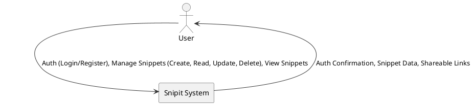
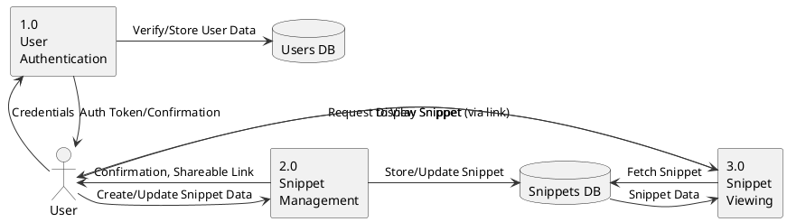
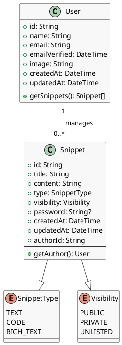

Of course. I will help you generate a comprehensive academic project proposal for your web application. I will follow the structure you've provided and use the context of the codebase to ensure the details are technically relevant.

Here is the draft content for your academic project proposal:

### 1. Title of the Project

**Snipit: A Secure and Shareable Snippet Management System**

### 2. Introduction and Objectives

In the digital age, the ability to quickly capture, manage, and share information is paramount for productivity and collaboration. Developers, writers, students, and professionals constantly work with fragments of information—code snippets, notes, commands, links, and temporary text. Existing tools like traditional note-taking apps can be too cumbersome for managing these small, ephemeral pieces of content, while simple text editors lack features for sharing and organization. This creates a gap for a specialized tool designed for efficient snippet management.

The "Snipit" project addresses this need by providing a streamlined web application for managing and sharing text-based snippets. The primary motivation is to offer a platform that combines the simplicity of a text editor with the power of a content management system, focused exclusively on snippets. The system is designed to be fast, accessible, and secure, allowing users to save plain text, formatted code with syntax highlighting, or rich text content.

The core of the project revolves around flexible sharing and access control. Users can keep snippets private for personal use, share them publicly with a wide audience, or share them selectively using unlisted links, which can be optionally password-protected. This granular control ensures that users can confidently store both sensitive information and public-facing content within the same platform. Upon saving, each snippet is assigned a unique, short, and shareable URL, making it easy to distribute.

**Objectives:**

- **To develop a robust web application** for creating, editing, and deleting snippets of various types (plain text, code, rich text).
- **To implement a secure user authentication and authorization system** to manage user accounts and protect private snippets.
- **To design and implement a flexible visibility and sharing system**, including public, private, and unlisted (password-protected) options.
- **To automatically generate unique and persistent links** for each snippet to facilitate easy sharing.
- **To provide a clean, intuitive, and responsive user interface** for a seamless user experience across different devices.
- **To ensure the application is performant and scalable** to handle a growing number of users and snippets.

Real-world applications for Snipit are numerous. A developer can use it to store and share reusable code fragments with their team. A technical support agent can use it to quickly share command-line instructions with a customer. An educator can create and share notes or code examples with students. In essence, Snipit can serve as a centralized hub for any user who needs to manage and share small blocks of information efficiently.

### 3. Project Category

**Category:** Web Application / RDBMS (Relational Database Management System)

**Justification:**

This project falls primarily into the **Web Application** category, as its core is a user-facing application delivered over the internet via a web browser. It involves front-end development (UI/UX) and back-end development (server-side logic, API, database interaction).

It also has a strong **RDBMS** component. The system's functionality relies heavily on a structured relational database to store and manage data for users, snippets, and their associated properties (like visibility, passwords, and relationships). The integrity and structure of the data are crucial, making the database design and management a key part of the project. The use of technologies like Prisma ORM with a PostgreSQL database further solidifies this classification.

### 4. Analysis

#### Data Flow Diagrams (DFD)

Here are the Level 0 and Level 1 DFDs representing the flow of data within the Snipit system.

**Level 0 DFD (Context Diagram)**



**Level 1 DFD**



#### Class Diagram

This class diagram illustrates the main entities of the system and their relationships.



#### Database Schema and Design

The database is designed to be simple yet effective, with two primary tables: `User` and `Snippet`.

- **`User` Table**: Stores information about registered users.

  - `id` (Primary Key, String): Unique identifier for the user (e.g., CUID).
  - `name` (String, Nullable): The user's name.
  - `email` (String, Unique): The user's email address, used for login.
  - `emailVerified` (DateTime, Nullable): Timestamp when the user's email was verified.
  - `image` (String, Nullable): URL for the user's profile picture.
  - `createdAt` (DateTime): Timestamp of account creation.
  - `updatedAt` (DateTime): Timestamp of the last update to the user's record.
  - Other fields for authentication providers (e.g., via NextAuth.js) would also be present (`Account`, `Session`, `VerificationToken` tables).

- **`Snippet` Table**: Stores the snippets created by users.
  - `id` (Primary Key, String): Unique identifier for the snippet (e.g., CUID).
  - `title` (String): The title of the snippet.
  - `content` (String): The main content of the snippet (text, code, or markdown/HTML for rich text).
  - `type` (Enum: `TEXT`, `CODE`, `RICH_TEXT`): The type of the snippet.
  - `visibility` (Enum: `PUBLIC`, `PRIVATE`, `UNLISTED`): The visibility setting for the snippet.
  - `password` (String, Nullable): A hashed password for unlisted snippets. It is `NULL` if no password is set.
  - `authorId` (Foreign Key, String): A reference to the `id` of the user who created the snippet. This establishes the relationship between `User` and `Snippet`.
  - `createdAt` (DateTime): Timestamp of snippet creation.
  - `updatedAt` (DateTime): Timestamp of the last update.

**Relationships:**

- A **one-to-many relationship** exists between `User` and `Snippet`. One user can create many snippets, but each snippet belongs to only one user (`authorId`).
- The `authorId` in the `Snippet` table is indexed to ensure fast lookups of all snippets belonging to a user.

### 5. Project Structure

#### Modules

1.  **Authentication Module (`next-auth`)**:

    - **Description**: Handles user registration, login (email/password and OAuth providers like Google/GitHub), and session management. It secures endpoints and ensures that only authenticated users can create snippets and access their private content.
    - **Core Functions**: `signIn()`, `signOut()`, `getSession()`, `adapter` for database interaction.

2.  **API/Backend Module (`Next.js API Routes`)**:

    - **Description**: Provides the server-side logic via RESTful API endpoints. This module handles all CRUD (Create, Read, Update, Delete) operations for snippets. It processes requests from the frontend, interacts with the database via the ORM, and enforces business logic (e.g., checking passwords for unlisted snippets).
    - **Core Functions**: `POST /api/snippets` (create), `GET /api/snippets/[id]` (read), `PUT /api/snippets/[id]` (update), `DELETE /api/snippets/[id]` (delete).

3.  **Database Module (`Prisma ORM`)**:

    - **Description**: Acts as the data access layer. Prisma provides an abstraction over the SQL database, allowing the application to interact with data using type-safe queries. It manages database connections, migrations, and schema definitions.
    - **Core Functions**: `prisma.snippet.create()`, `prisma.snippet.findUnique()`, `prisma.snippet.update()`, `prisma.snippet.delete()`.

4.  **Frontend/UI Module (`React/Next.js`)**:
    - **Description**: This is the client-side of the application, which is rendered in the user's browser. It includes all the UI components (forms, buttons, editors), state management, and logic for interacting with the backend API. It's responsible for providing a responsive and interactive user experience.
    - **Core Functions**: Components for snippet creation/editing, a dashboard for viewing personal snippets, and a public-facing page for viewing shared snippets.

#### Pseudocode for Core Functions

**Create Snippet Logic (`/api/snippets` - POST)**

```
FUNCTION handleCreateSnippet(request):
  session = getSession(request)
  IF session is NULL:
    RETURN 401 Unauthorized

  data = parse_json_body(request)
  // Validation: check for required fields like content, title
  IF data is invalid:
    RETURN 400 Bad Request

  userId = session.user.id
  snippetData = {
    title: data.title,
    content: data.content,
    type: data.type,
    visibility: data.visibility,
    authorId: userId
  }

  IF data.visibility == 'UNLISTED' AND data.password is not empty:
    snippetData.password = HASH(data.password)

  newSnippet = prisma.snippet.create(data: snippetData)
  RETURN 201 Created, { snippetId: newSnippet.id }
```

**View Snippet Logic (`/snippets/[id]` - Page Load)**

```
FUNCTION handleViewSnippet(snippetId, request):
  snippet = prisma.snippet.findUnique(where: { id: snippetId })
  IF snippet is NULL:
    RETURN 404 Not Found

  IF snippet.visibility == 'PRIVATE':
    session = getSession(request)
    IF session is NULL OR session.user.id != snippet.authorId:
      RETURN 403 Forbidden

  IF snippet.visibility == 'UNLISTED' AND snippet.password is not NULL:
    // Frontend should prompt for password
    userPassword = getPasswordFromUser()
    IF HASH(userPassword) != snippet.password:
      RETURN 401 Unauthorized (Password incorrect)

  // If all checks pass
  RENDER SnippetViewPage with snippet_data
```

#### Testing Strategies

- **Unit Testing**: Use a framework like Jest or Vitest to test individual functions and components in isolation.
  - Test API route handlers with mock requests/responses.
  - Test utility functions (e.g., validation logic).
  - Test React components to ensure they render correctly based on props.
- **Integration Testing**: Test the interaction between different modules.
  - Use a testing library (e.g., React Testing Library) to test user flows on the frontend (e.g., creating a snippet and seeing it on the dashboard).
  - Test the full request-response cycle from the frontend, through the API, to the database, and back. A test database would be used for this.
- **End-to-End (E2E) Testing**: Use a tool like Cypress or Playwright to simulate real user behavior in a browser.
  - Write scripts to automate user journeys: registration, login, creating a public snippet, sharing the link, and viewing it in an incognito window.
  - Test creating a password-protected snippet and verifying the password prompt.

### 6. Tools, Platform, Hardware/Software Requirements

- **Languages**: TypeScript, JavaScript, HTML, CSS
- **Frameworks/Libraries**:
  - **Backend/Frontend**: Next.js (with React)
  - **Styling**: Tailwind CSS
  - **Database ORM**: Prisma
  - **Authentication**: NextAuth.js
- **Database**: PostgreSQL (or any other SQL database supported by Prisma, like MySQL or SQLite).
- **Platform/OS**:
  - **Development**: Any modern OS like Windows, macOS, or Linux.
  - **Deployment**: A cloud platform like Vercel (ideal for Next.js), AWS, or any Linux-based server.
- **Software Requirements**:
  - Node.js (v18 or later)
  - npm/yarn/pnpm package manager
  - A modern web browser (e.g., Chrome, Firefox)
- **Hardware Requirements**:
  - **Development**: Standard developer machine (e.g., 8GB RAM, 2-core CPU, 256GB SSD) is sufficient.
  - **Server (Deployment)**: Depends on traffic. A basic cloud instance (e.g., 1 vCPU, 2GB RAM) is a good starting point and can be scaled as needed.

### 7. Industry/Client Association

This is an **academic/personal project**. It is conceived and developed as a part of academic coursework and to build a portfolio. It is not associated with any external client or commercial organization. The primary goal is educational and to demonstrate proficiency in full-stack web development.

### 8. Future Scope and Enhancements

- **Collaboration Features**: Allow multiple users to co-edit a snippet in real-time, similar to Google Docs.
- **Snippet Organization**: Introduce folders, tags, or categories to help users organize their snippets more effectively.
- **Versioning**: Keep a history of changes for each snippet, allowing users to view and revert to previous versions.
- **Advanced Search**: Implement a more powerful search functionality, possibly using a full-text search engine like Elasticsearch, to search within snippet content.
- **API for Third-Party Integrations**: Expose a public API so that other applications (like IDE extensions or command-line tools) can interact with Snipit.
- **Desktop Application**: Create a lightweight desktop app (using Electron or Tauri) for even quicker access to snippets.
- **GPT/AI Integration**:
  - **AI-Powered Suggestions**: Integrate with a large language model (like GPT-4) to provide features like "explain this code," "refactor this code," or "improve this writing."
  - **AI-Generated Snippets**: Allow users to generate code or text from a natural language prompt directly within the application.
- **Analytics**: Provide users with analytics on their public snippets, such as view counts, referrers, and geographic data.
